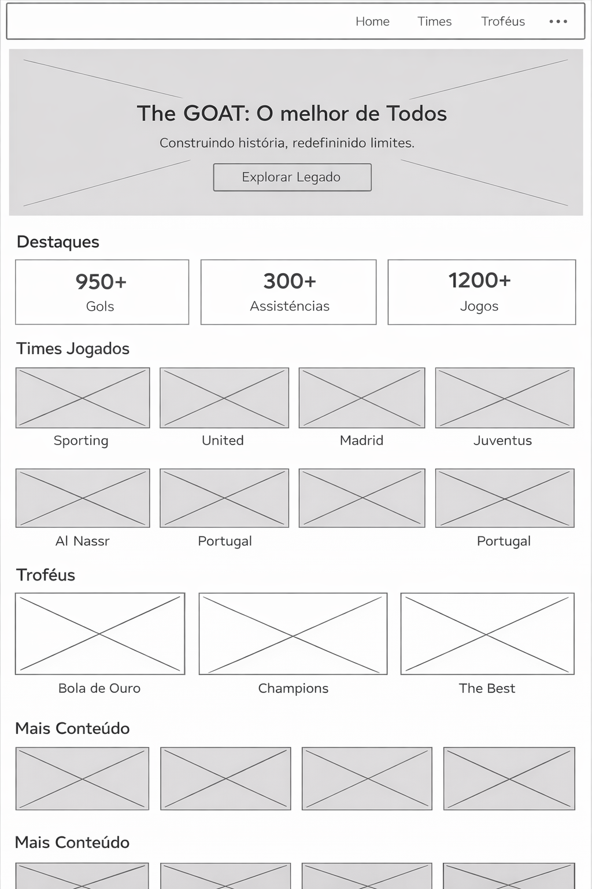
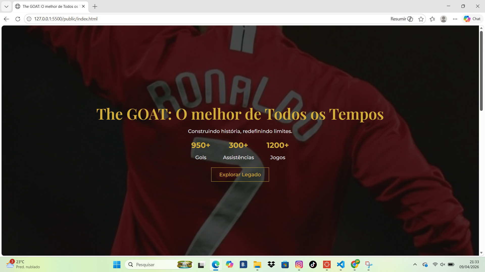
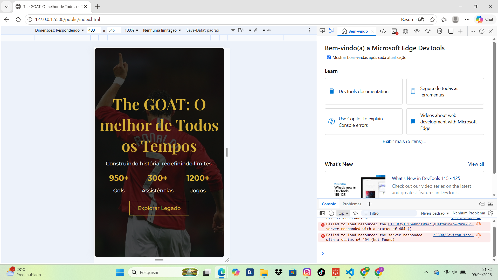

## 📌 Projeto Web - The GOAT

## 👤 Dados do Aluno

Nome: Arthur Ramos
Matrícula: 915280

## 💡 Proposta de Projeto

Desenvolver uma página web temática inspirada no conceito de “GOAT” (Greatest of All Time), destacando a carreira de um jogador de futebol através de um layout moderno, responsivo e visualmente atrativo, com foco em apresentação de dados, times e conquistas.

## 📝 Descrição do Projeto

O projeto consiste na criação de uma landing page utilizando HTML e CSS, com um design sofisticado baseado em cores escuras e detalhes em dourado, transmitindo uma identidade premium.

A página foi estruturada em seções principais:

Hero (capa principal): Apresenta o título, uma frase de impacto e estatísticas relevantes (gols, assistências e jogos).
Times Jogados: Exibe os clubes e seleção pelos quais o jogador passou, com cards interativos e imagens de fundo.
Troféus: Mostra as principais conquistas da carreira em formato de cards organizados em grid.

Além disso, o layout foi pensado para ser moderno e organizado, inspirado em interfaces como plataformas de streaming e vídeo, priorizando a experiência do usuário (UX) e a clareza das informações.

## 🧩 Wireframe do Projeto

## Screenshots

## Print da versão responsiva com CSS puro [DESKTOP]

## Print da versão responsiva com CSS puro [MOBILE] (*)

